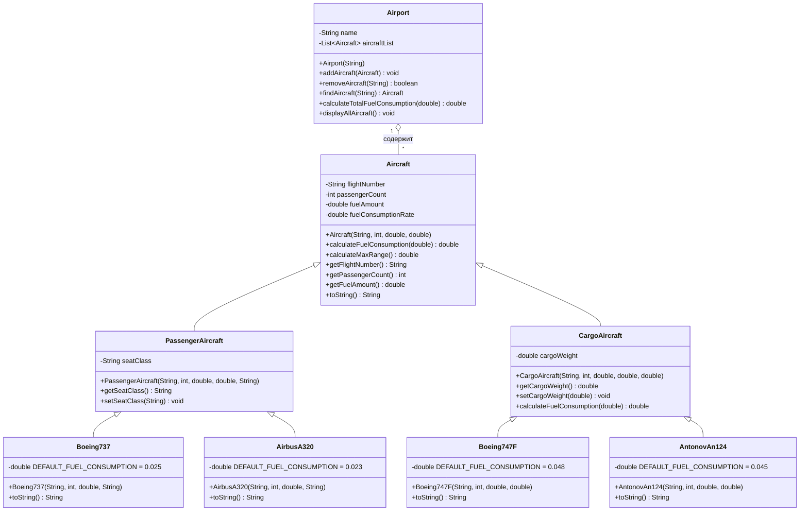

# UML Диаграмма иерархии классов самолетов

```mermaid
classDiagram
    class Aircraft {
        -String flightNumber
        -int passengerCount
        -double fuelAmount
        -double fuelConsumptionRate
        +Aircraft(String, int, double, double)
        +calculateFuelConsumption(double) double
        +calculateMaxRange() double
        +getFlightNumber() String
        +getPassengerCount() int
        +getFuelAmount() double
        +toString() String
    }

    class PassengerAircraft {
        -String seatClass
        +PassengerAircraft(String, int, double, double, String)
        +getSeatClass() String
        +setSeatClass(String) void
    }

    class CargoAircraft {
        -double cargoWeight
        +CargoAircraft(String, int, double, double, double)
        +getCargoWeight() double
        +setCargoWeight(double) void
        +calculateFuelConsumption(double) double
    }

    class Boeing737 {
        -double DEFAULT_FUEL_CONSUMPTION = 0.025
        +Boeing737(String, int, double, String)
        +toString() String
    }

    class AirbusA320 {
        -double DEFAULT_FUEL_CONSUMPTION = 0.023
        +AirbusA320(String, int, double, String)
        +toString() String
    }

    class Boeing747F {
        -double DEFAULT_FUEL_CONSUMPTION = 0.048
        +Boeing747F(String, int, double, double)
        +toString() String
    }

    class AntonovAn124 {
        -double DEFAULT_FUEL_CONSUMPTION = 0.045
        +AntonovAn124(String, int, double, double)
        +toString() String
    }

    class Airport {
        -String name
        -List~Aircraft~ aircraftList
        +Airport(String)
        +addAircraft(Aircraft) void
        +removeAircraft(String) boolean
        +findAircraft(String) Aircraft
        +calculateTotalFuelConsumption(double) double
        +displayAllAircraft() void
    }

    Aircraft <|-- PassengerAircraft
    Aircraft <|-- CargoAircraft
    PassengerAircraft <|-- Boeing737
    PassengerAircraft <|-- AirbusA320
    CargoAircraft <|-- Boeing747F
    CargoAircraft <|-- AntonovAn124
    Airport "1" o-- "*" Aircraft : содержит
```